<p align="center">
  
</p>

<h1 align="center">Myna Flow</h1>

<p align="center">
  <strong>Hold a key. Talk. Your words appear in any text field.</strong><br>
  Free, open source, and completely offline dictation for macOS.
</p>

<p align="center">
  <a href="#install">Install</a> &middot;
  <a href="#the-three-shortcuts-that-matter">Shortcuts</a> &middot;
  <a href="#what-it-does">Features</a> &middot;
  <a href="#private-by-design">Privacy</a> &middot;
  <a href="#security">Security</a> &middot;
  <a href="#when-something-goes-wrong">Help</a>
</p>

<p align="center">
  <a href="https://github.com/itssrb24/MynaFlow/releases"></a>
  <a href="#what-you-need"></a>
  <a href="#private-by-design"></a>
  <a href="LICENSE"></a>
</p>

<p align="center">
  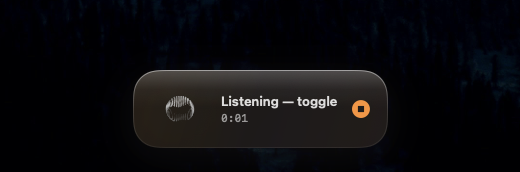
</p>

Talking is about three times faster than typing. Myna Flow puts that speed into
every app you already use &mdash; Mail, Slack, Notes, your browser, your editor
&mdash; with no account, no subscription, and no cloud.

**It is completely open source and it runs completely offline.** Your voice is
turned into text by your own Mac. Once the models are downloaded you can put the
machine in airplane mode and every feature still works, because there is no
server on the other end. Nothing is uploaded, because there is nowhere to upload
it to. Every line of that claim is in this repository, and the last section of
this page shows you how to verify it yourself in one command.

---

## Install

**You need macOS 26 or later.** Apple menu &#9654; About This Mac tells you
which version you have. Older versions cannot run this app at all &mdash; it
uses a speech component Apple only shipped in macOS 26.

### Option A &mdash; download it

1. Grab the latest zip from the [releases page](https://github.com/itssrb24/MynaFlow/releases) and unzip it.
2. Drag **Myna Flow** into your **Applications** folder.
3. **Right-click** the app and choose **Open**. Not double-click &mdash; see below.
4. macOS says it cannot verify the developer. Click **Open**. Once only.

<details>
<summary><strong>Why does macOS warn me?</strong></summary>

<br>

macOS stamps a quarantine flag on everything you download, and opens a
quarantined app without complaining only if the developer pays Apple $99 a year
to notarize it. This app is properly signed, just not notarized, so you get one
warning. It is about who paid Apple, not about what the app does.

Double-clicking the first time gives you a dialog with no way forward.
Right-click &#9654; Open is the one that offers an **Open** button.

**Never run `xattr` or `sudo` commands you find online to silence warnings like
this.** Getting comfortable doing that is exactly what malware relies on.
Right-click &#9654; Open is the button Apple provides, and it is enough.

</details>

### Option B &mdash; build it yourself

An app built on your own Mac was never downloaded, so it never gets the
quarantine flag, so there is **no warning at all**. You need Xcode from the App
Store.

```bash
git clone https://github.com/itssrb24/MynaFlow.git
cd MynaFlow
./Scripts/install.sh
```

That checks your macOS version, builds the app, installs it into Applications
and opens it. To update later, `git pull` and run it again.

### First run

Myna Flow lives in the menu bar and has no Dock icon. It walks you through:

1. **Microphone**, so it can hear you.
2. **Accessibility**, so it can type into other apps. macOS opens System
   Settings; switch Myna Flow on, then come back.
3. A first dictation, to prove it works.

> If the shortcut does nothing right after you grant Accessibility, quit Myna
> Flow from the menu bar and open it again.

---

## The three shortcuts that matter

| Shortcut | What happens |
|---|---|
| Hold **&#8984;&#8679;Space** | Records while you hold it. Let go and the text appears in the text field you are in. |
| **&#8984;&#8963;Space** | Starts recording, press again to stop. For longer stretches. |
| **Esc** | Cancels. Nothing inserted, nothing saved, the audio deleted. |

Everything is remappable, including the polish styles, and nothing steals focus
from the app you are typing in.

<p align="center">
  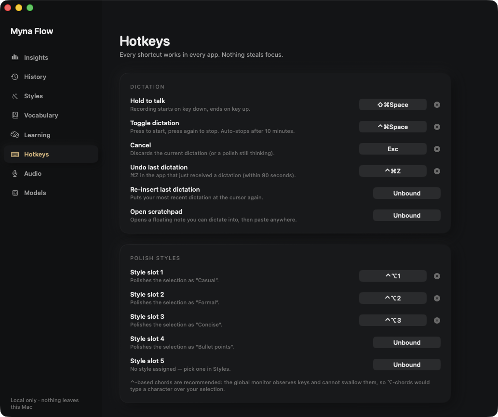
</p>

---

## What it does

### Dictate into anything

Text is typed straight into the focused field using macOS accessibility. Some
editors draw their own canvas and expose no text field at all &mdash; Google
Docs is the common one &mdash; so Myna Flow pastes into those instead. There is
nothing to configure per app: one set of settings applies everywhere.

<p align="center">
  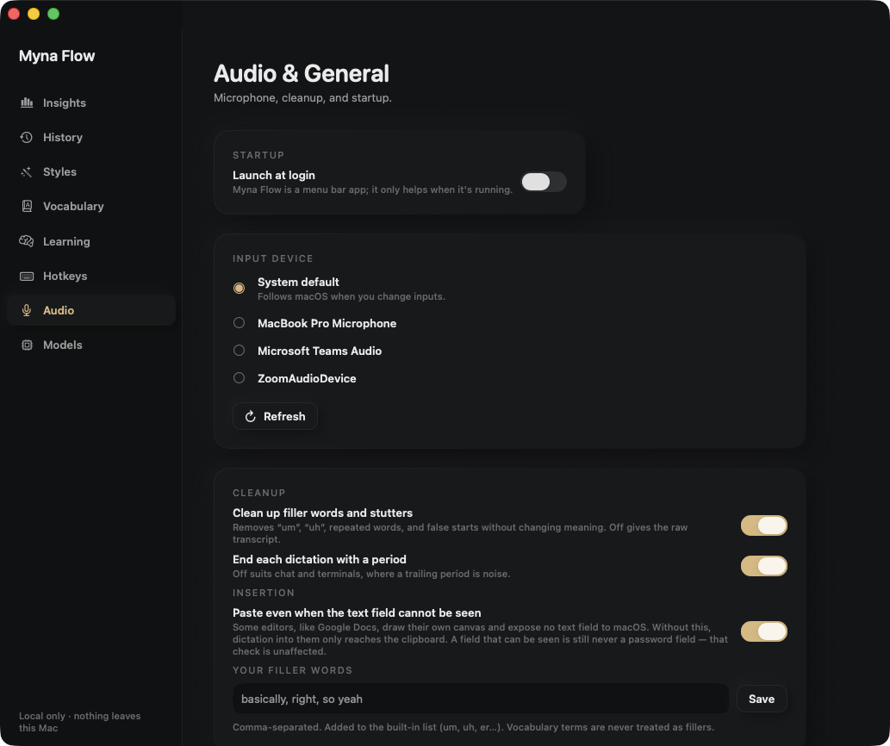
</p>

### Clean up what you actually said

Every dictation passes through a cleanup step that drops filler words, false
starts and stutters without changing your meaning. Add your own filler words if
you like; anything in your Vocabulary is never treated as filler.

### Rewrite in a style, on demand

Polish takes what you said, or whatever you have selected in any app, and
rewrites it. Casual, Formal, Concise, or your own. It uses a language model you
download explicitly and which runs locally. Nothing is polished unless you ask.

<p align="center">
  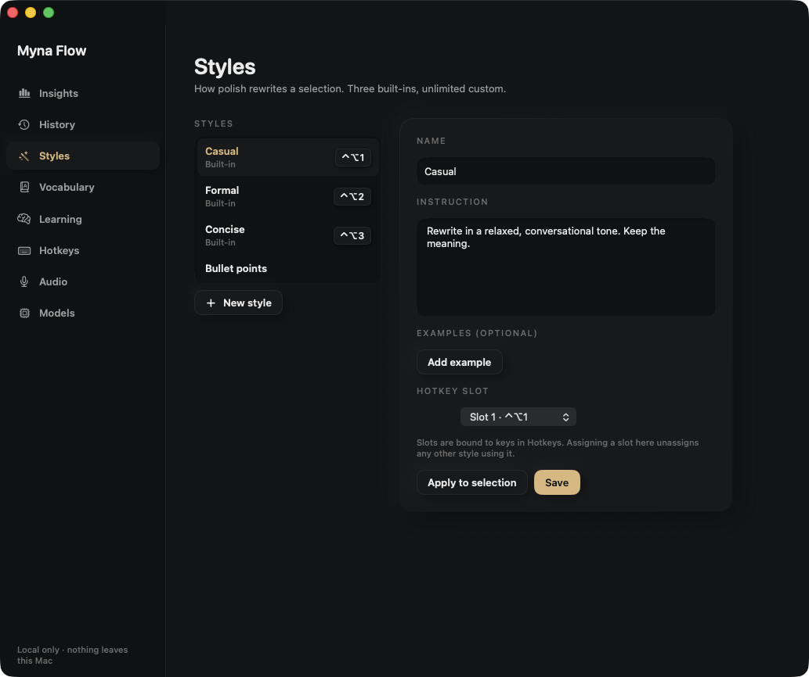
</p>

### Teach it your words

Add names, jargon and acronyms to **Vocabulary** and the recogniser is biased
toward them. Turn **Learning** on and Myna Flow notices corrections you keep
making by hand and offers them back as rules, which you accept or reject one at
a time. It never changes anything on its own.

<p align="center">
  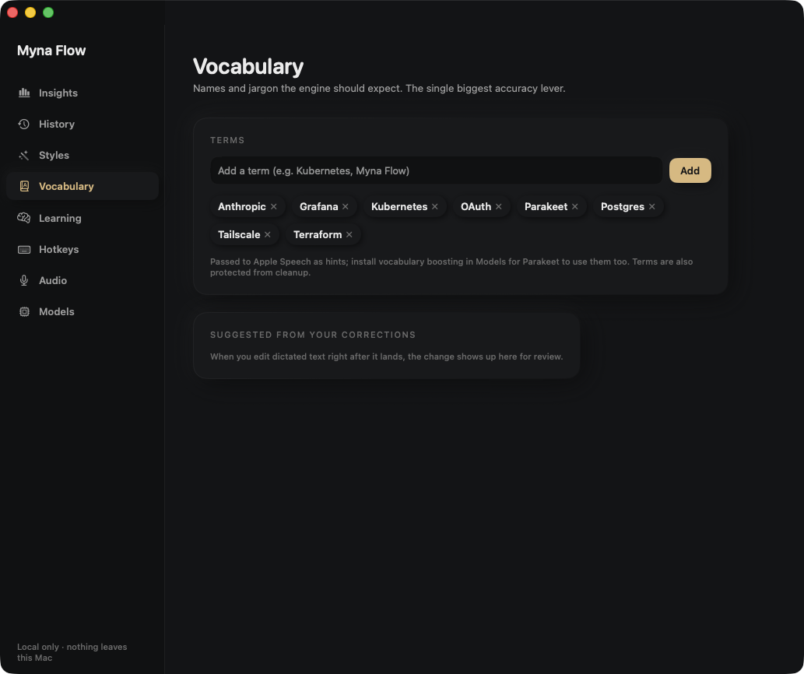
  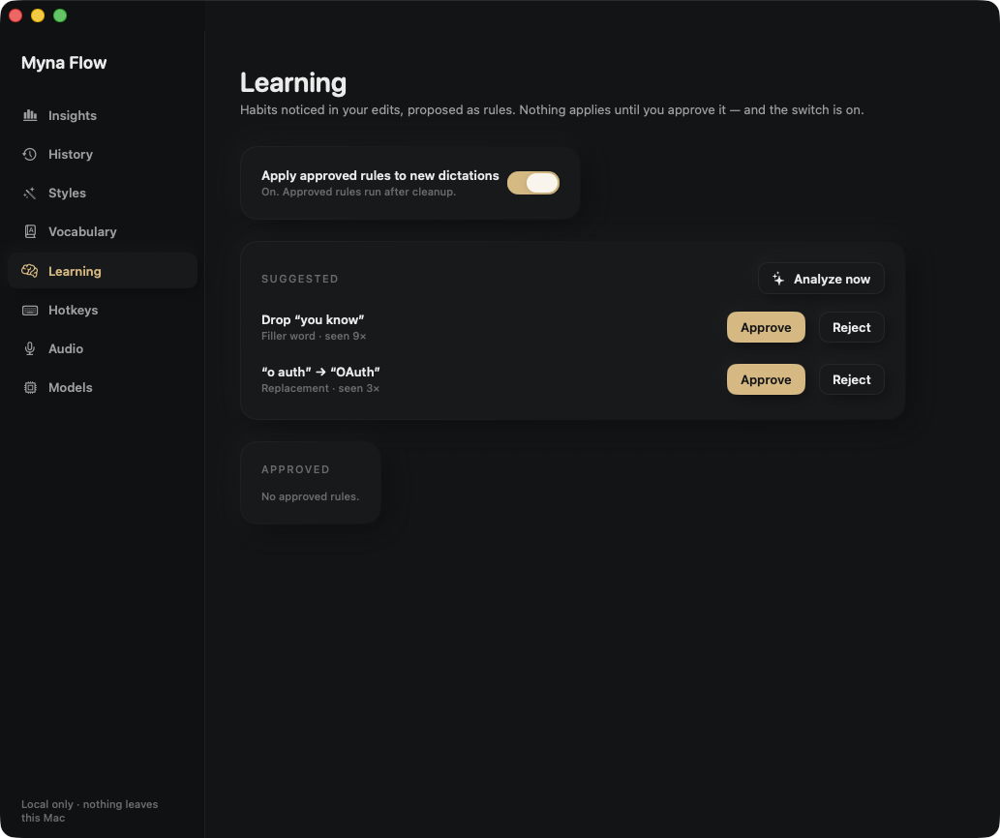
</p>

### See what you dictated, and what it saved you

Everything is searchable, re-insertable and deletable. Insights turns the same
data into how much time you saved and how fast you actually speak.

<p align="center">
  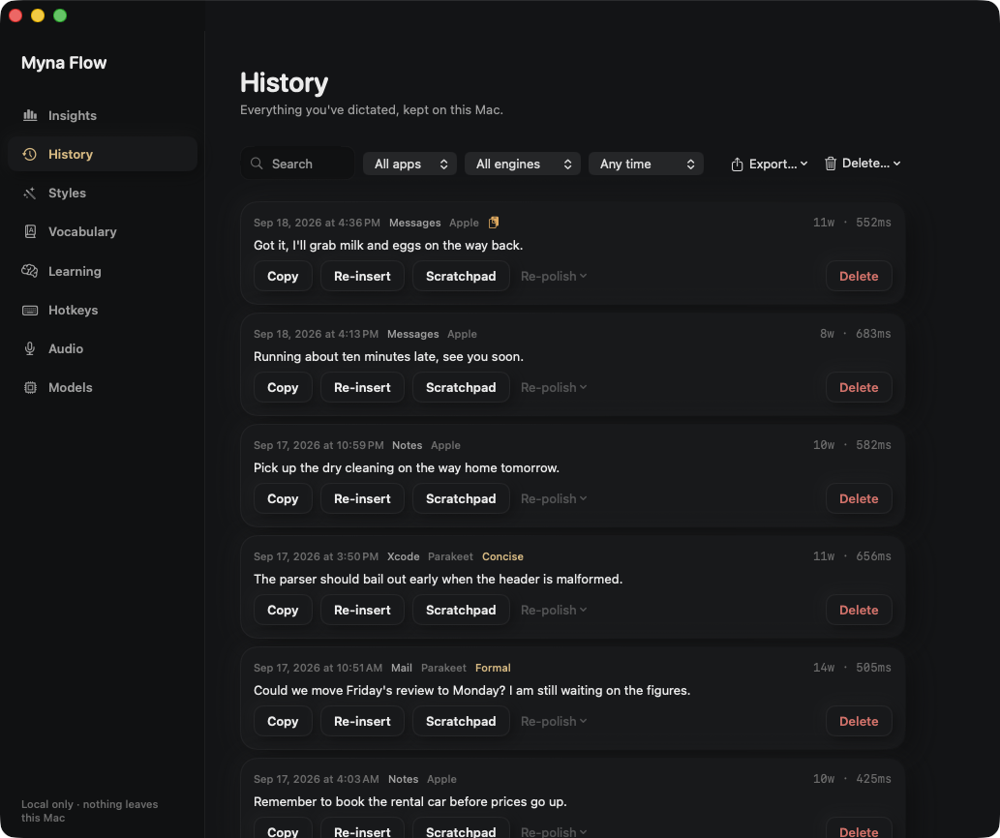
  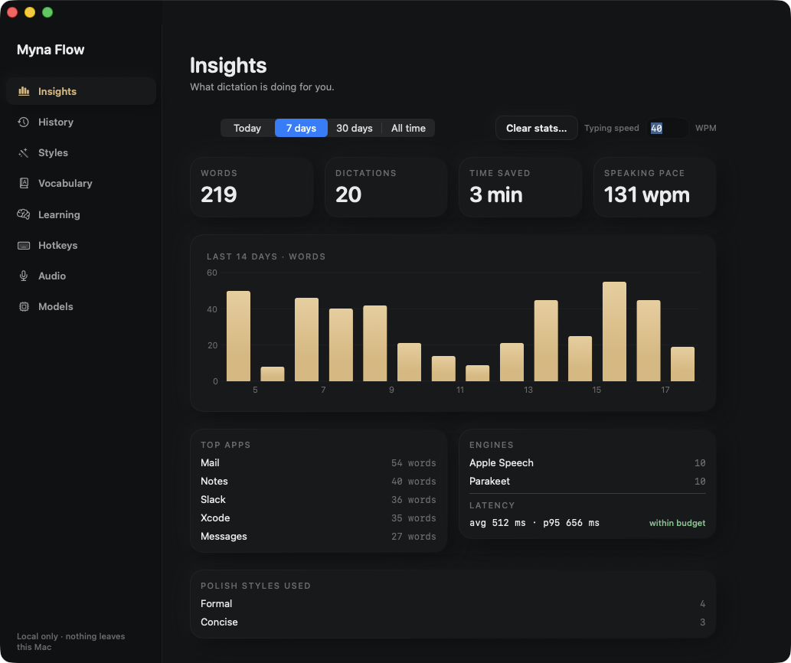
</p>

### Two speech engines

| Engine | Size | Good for |
|---|---|---|
| **Apple Speech** | built into macOS | Everyday dictation, nothing to download |
| **Parakeet** | ~600 MB, downloaded only if you choose | Names, jargon, technical vocabulary |

Both are chosen in **Models**, which is also where the optional downloads
live &mdash; nothing is fetched until you press the button.

<p align="center">
  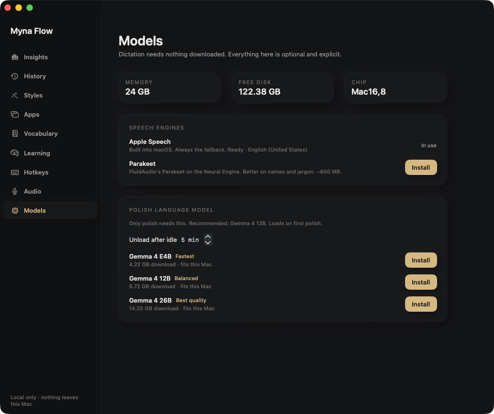
</p>

All of it sits behind one menu bar icon.

<p align="center">
  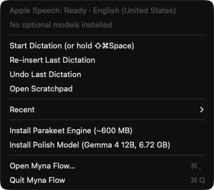
</p>

---

## Private by design

Myna Flow is offline software. The internet is used **once**, to fetch the
models, and then not again. Here is exactly when, and why.

### Step 1 &mdash; setup: the only time the internet is used

Speech and language models are far too large to ship inside an app bundle, so
they are downloaded the first time you ask for them. You choose when. Nothing
downloads by itself, and nothing is sent &mdash; this traffic is a file coming
down, never your data going up.

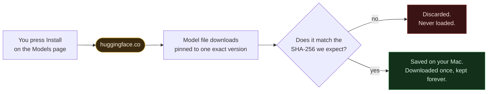

There is one download the app does not perform itself: the first time you
dictate, macOS fetches Apple's own speech files. That happens inside an Apple
system service rather than inside this app, and it is also a one-time event.

### Step 2 &mdash; every dictation after that: no internet at all

From here on the app never opens a network connection. Airplane mode changes
nothing.

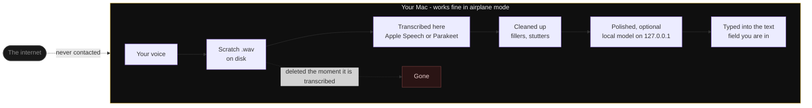

Even the polish model, which is a real language model, runs as a local process
bound to `127.0.0.1` &mdash; your own machine talking to itself, on an address
that cannot leave it.

### What that means concretely

- **Your audio** is written to a scratch file while you speak and deleted the
  moment it has been transcribed &mdash; on every path, including failures and
  cancellation. Anything stranded by a crash is swept at the next launch.
- **Your text** is stored only in an ordinary SQLite file in
  `~/Library/Application Support/Myna Flow/`. You can open it, export it, or
  delete the folder and leave nothing behind.
- **No telemetry, no analytics, no crash reporting, no update check, no
  account.** There is no server component to this project at all.

### Prove it yourself

With the app running, this lists every network connection it has open. It should
print nothing:

```bash
lsof -nP -i -a -p $(pgrep -x MynaFlow)
```

And this confirms the app you installed is the one that was signed, unmodified:

```bash
codesign --verify --strict --deep "/Applications/Myna Flow.app" && echo "intact"
```

---

## Security

Being open source is half of why you can trust an app. The other half is that it
is built to fail safe when something goes wrong.

| Concern | What the app does about it |
|---|---|
| **Password fields** | Dictated text is never typed into a secure field, and never placed on the clipboard while one is focused. If the app cannot tell where keyboard focus is *and* the window contains a password field, it refuses to insert rather than guess. |
| **Tampered downloads** | Model downloads are pinned to one exact version and checked against a SHA-256 before use. A file that does not match is discarded, not loaded. |
| **Tampered binaries** | The bundled llama.cpp binaries are checksummed against a manifest that is sealed inside the app's own code signature. Replacing one means forging the manifest *and* breaking the signature. |
| **Clipboard hygiene** | Clipboard writes are marked concealed and transient, so password managers and clipboard-history apps skip them, and your previous clipboard contents are restored afterwards. |
| **File permissions** | The database is `0600` and its directories `0700`, re-asserted on every launch rather than assumed. |
| **Process isolation** | The polish model runs as a separate process under the hardened runtime, bound to loopback only. |
| **Logs** | The diagnostics log records what happened, never what you said, and passes through a redactor before anything is written. |

### Permissions

Myna Flow asks for two permissions and no others.

| Permission | Why | Without it |
|---|---|---|
| **Microphone** | To hear you | Nothing works |
| **Accessibility** | To type into the focused text field, and read your selection when you ask for a polish | Shortcuts and insertion stop working |

No Screen Recording, no Full Disk Access, no Contacts, no Calendar, and no login
item unless you switch one on.

> **Accessibility is a real power** and worth being plain about: the same
> permission that lets the app type for you would let it read the focused text
> field of any app. Myna Flow uses it narrowly &mdash; read the selection when
> you ask for a polish, write into the focused field when you dictate. The
> protection is not a sandbox, because an app cannot hold Accessibility and be
> sandboxed at the same time. It is that the code is right here, in the open,
> and the use is narrow enough to check.

---

## What you need

- A Mac running **macOS 26 or later**
- A microphone
- Roughly 1 GB of disk if you want the optional Parakeet engine, more for a polish model

---

## When something goes wrong

| Symptom | Fix |
|---|---|
| The shortcut does nothing | Quit Myna Flow from the menu bar and reopen it. Global shortcuts only bind once Accessibility is granted. |
| Text lands in the wrong app | Click where you want the text *before* you start dictating. |
| Nothing is inserted in Google Docs | Check **Audio** ▸ *Paste even when the text field cannot be seen* is on. Docs exposes no text field, so this is the only way text reaches it. |
| Dictation feels slow | Switch to Apple Speech in **Models**, or keep dictations shorter. |

Still stuck? Open Myna Flow &#9654; **Audio** &#9654; **Export diagnostics...**
and attach that file to an [issue](https://github.com/itssrb24/MynaFlow/issues).
It records what happened, never what you said.

### Removing it

Drag the app to the Trash, then delete `~/Library/Application Support/Myna Flow`
to remove the history too.

---

## Building from source

```bash
swift build              # build
swift test               # the test suite
./Scripts/build-app.sh   # assemble and sign dist/Myna Flow.app
./Scripts/release.sh     # the above, plus a distributable zip
```

<details>
<summary>Notes on signing</summary>

<br>

`build-app.sh` signs with the first "Apple Development" identity in your
keychain, or whatever you set in `SIGN_IDENTITY`. It fails rather than quietly
falling back to an ad-hoc signature, because an ad-hoc bundle gets a weak,
path-based Accessibility grant that any replacement at the same path inherits.

`release.sh` prefers a self-signed certificate named **Myna Flow**, so published
builds do not carry a personal Apple Development identity &mdash; the common
name of one of those is the developer's email address, and it would end up in
every copy of the download. Create one in Keychain Access &#9654; Certificate
Assistant &#9654; Create a Certificate, with identity type "Self Signed Root"
and certificate type "Code Signing". Release builds also use a neutral build
directory and strip the linker's debug map, both of which would otherwise record
the build machine's home directory inside the binary.

</details>

---

## Third-party code

- **ThinkingOrbsKit** &mdash; the animated orb. MIT, &copy; 2026 Jakub Antalik. Vendored verbatim in `Sources/ThinkingOrbsKit`.
- **[FluidAudio](https://github.com/FluidInference/FluidAudio)** &mdash; Parakeet speech recognition.
- **[llama.cpp](https://github.com/ggml-org/llama.cpp)** &mdash; runs the polish model. Prebuilt binaries in `Sources/MynaFlowApp/Resources/Runtimes`, checked against a manifest before the app will launch them.

## Licence

[MIT](LICENSE).

<p align="center">
  <sub>Screenshots use sample data, not real dictations.</sub>
</p>
