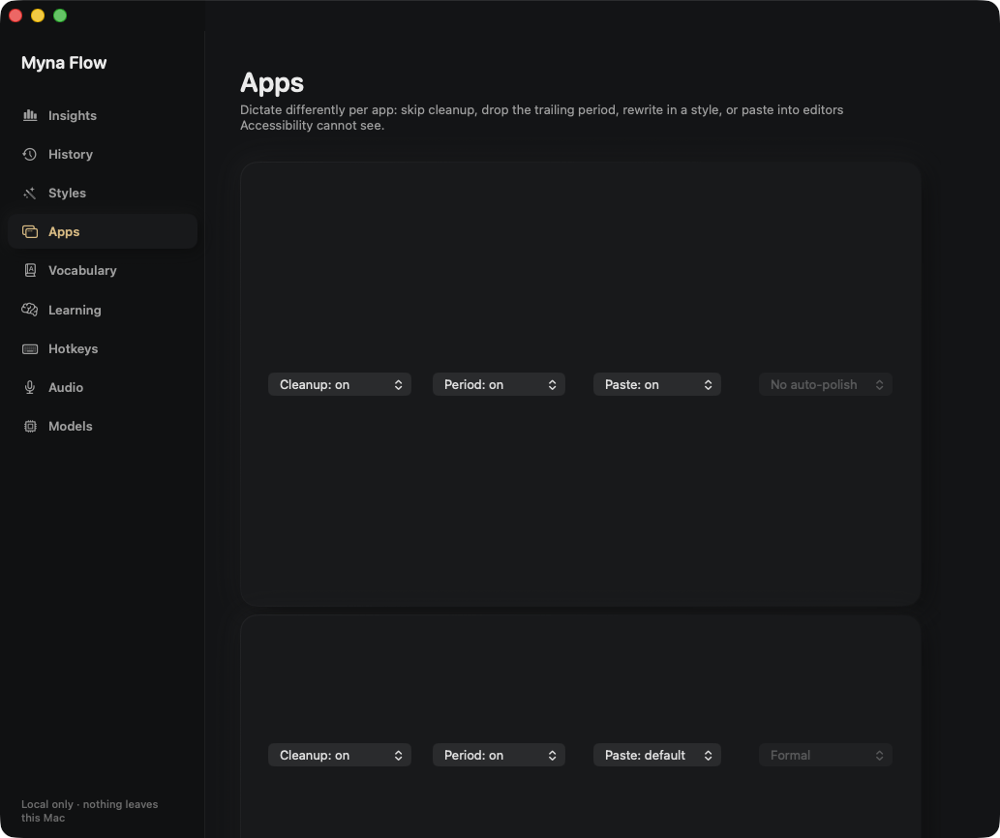
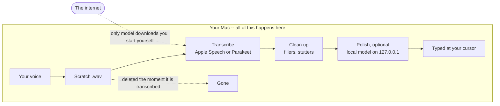

<h1 align="center">Myna Flow</h1>

<p align="center">
  <strong>Hold a key. Talk. Your words appear wherever your cursor is.</strong><br>
  Dictation for macOS that runs entirely on your own Mac.
</p>

<p align="center">
  <a href="#install">Install</a> &middot;
  <a href="#the-three-shortcuts-that-matter">Shortcuts</a> &middot;
  <a href="#what-it-does">Features</a> &middot;
  <a href="#where-your-words-go">Privacy</a> &middot;
  <a href="#when-something-goes-wrong">Help</a>
</p>

<p align="center">
  <a href="https://github.com/itssrb24/MynaFlow/releases"></a>
  <a href="#what-you-need"></a>
  <a href="#where-your-words-go"></a>
  <a href="LICENSE"></a>
</p>

<p align="center">
  
</p>

Talking is about three times faster than typing. Myna Flow puts that speed in
every app you already use &mdash; Mail, Slack, Notes, your browser, your editor
&mdash; without sending a syllable anywhere. Speech recognition runs on your
Mac, your history is a file in your own Library folder, and once the models are
on disk the app opens no network connections at all.

---

## Install

**You need macOS 26 or later.** Apple menu &#9654; About This Mac tells you
which version you have. Older versions cannot run this app at all &mdash; it
uses a speech component Apple only shipped in macOS 26.

### Option A &mdash; download it

1. Grab the latest zip from the [releases page](https://github.com/itssrb24/MynaFlow/releases) and unzip it.
2. Drag **Myna Flow** into your **Applications** folder.
3. **Right-click** the app and choose **Open**. Not double-click &mdash; see below.
4. macOS says it cannot verify the developer. Click **Open**. Once only.

<details>
<summary><strong>Why does macOS warn me?</strong></summary>

<br>

macOS stamps a quarantine flag on everything you download, and opens a
quarantined app without complaining only if the developer pays Apple $99 a year
to notarize it. This app is properly signed, just not notarized, so you get one
warning. It is about who paid Apple, not about what the app does.

Double-clicking the first time gives you a dialog with no way forward.
Right-click &#9654; Open is the one that offers an **Open** button.

**Never run `xattr` or `sudo` commands you find online to silence warnings like
this.** Getting comfortable doing that is exactly what malware relies on.
Right-click &#9654; Open is the button Apple provides, and it is enough.

</details>

### Option B &mdash; build it yourself

An app built on your own Mac was never downloaded, so it never gets the
quarantine flag, so there is **no warning at all**. You need Xcode from the App
Store.

```bash
git clone https://github.com/itssrb24/MynaFlow.git
cd MynaFlow
./Scripts/install.sh
```

That checks your macOS version, builds the app, installs it into Applications
and opens it. To update later, `git pull` and run it again.

### First run

Myna Flow lives in the menu bar and has no Dock icon. It walks you through:

1. **Microphone**, so it can hear you.
2. **Accessibility**, so it can type into other apps. macOS opens System
   Settings; switch Myna Flow on, then come back.
3. A first dictation, to prove it works.

> If the shortcut does nothing right after you grant Accessibility, quit Myna
> Flow from the menu bar and open it again.

---

## The three shortcuts that matter

| Shortcut | What happens |
|---|---|
| Hold **&#8984;&#8679;Space** | Records while you hold it. Let go and the text appears at your cursor. |
| **&#8984;&#8963;Space** | Starts recording, press again to stop. For longer stretches. |
| **Esc** | Cancels. Nothing inserted, nothing saved, the audio deleted. |

Everything is remappable, including the polish styles, and nothing steals focus
from the app you are typing in.

<p align="center">
  
</p>

---

## What it does

### Dictate into anything

Text is typed straight into the focused field using macOS accessibility. When an
app exposes no text field &mdash; Google Docs draws its own canvas, for instance
&mdash; you can allow a paste for that one app, and only that app.

### Clean up what you actually said

Every dictation passes through a cleanup step that drops filler words, false
starts and stutters without changing your meaning. Add your own filler words if
you like; anything in your Vocabulary is never treated as filler.

### Rewrite in a style, on demand

Polish takes what you said, or whatever you have selected in any app, and
rewrites it. Casual, Formal, Concise, or your own. It uses a language model you
download explicitly and which runs locally. Nothing is polished unless you ask.

<p align="center">
  
  
</p>

### Teach it your words

Add names, jargon and acronyms to **Vocabulary** and the recogniser is biased
toward them. Turn **Learning** on and Myna Flow notices corrections you keep
making by hand and offers them back as rules, which you accept or reject one at
a time. It never changes anything on its own.

<p align="center">
  
  
</p>

### See what you dictated, and what it saved you

Everything is searchable, re-insertable and deletable. Insights turns the same
data into how much time you saved and how fast you actually speak.

<p align="center">
  
  
</p>

### Two speech engines

| Engine | Size | Good for |
|---|---|---|
| **Apple Speech** | built into macOS | Everyday dictation, nothing to download |
| **Parakeet** | ~600 MB, downloaded only if you choose | Names, jargon, technical vocabulary |

Both are chosen in **Models**, which is also where the optional downloads
live &mdash; nothing is fetched until you press the button.

<p align="center">
  
</p>

All of it sits behind one menu bar icon.

<p align="center">
  
</p>

---

## Where your words go

Nowhere. That is the whole point, so here is the honest version.



- **Your audio** is written to a scratch file while you speak and deleted the
  moment it has been transcribed &mdash; on every path, including failures and
  cancellation. Anything stranded by a crash is swept at the next launch.
- **The network** is used for exactly three things, all of which you start:
  downloading the Parakeet model, downloading a polish model, and Apple's own
  one-time download of its speech files. Downloads are pinned to a specific
  version and verified against a SHA-256 before anything is used. There is no
  telemetry, no analytics, no crash reporting and no update check.
- **Password fields.** Dictated text is never inserted into a secure field and
  never placed on the clipboard while one is focused. If the app cannot tell
  where keyboard focus is and the window contains a password field, it refuses
  rather than guessing.
- **The clipboard** is used to insert text, and as a fallback when insertion
  fails. Those writes are marked concealed and transient so clipboard managers
  ignore them, and your previous contents are put back afterwards.
- **The diagnostics log** records what happened, never what you said.

Your data lives in `~/Library/Application Support/Myna Flow/` as an ordinary
SQLite file readable only by you. Delete that folder and nothing remains.

### Permissions

| Permission | Why | Without it |
|---|---|---|
| **Microphone** | To hear you | Nothing works |
| **Accessibility** | To type at your cursor, and read your selection when you ask for a polish | Shortcuts and insertion stop working |

Those are the only two. No Screen Recording, no Full Disk Access, and no login
item unless you turn one on.

> **Accessibility is a real power** and worth being plain about: the same
> permission that lets the app type for you would let it read the focused text
> field of any app. Myna Flow uses it narrowly &mdash; read the selection when
> you ask for a polish, write at the cursor when you dictate. The protection is
> not a sandbox, because an app cannot hold Accessibility and be sandboxed. It
> is that the code is right here and the use is narrow.

**Check it yourself.** With the app running, this prints every network socket it
has open. It should print nothing at all.

```bash
lsof -nP -i -a -p $(pgrep -x MynaFlow)
```

---

## What you need

- A Mac running **macOS 26 or later**
- A microphone
- Roughly 1 GB of disk if you want the optional Parakeet engine, more for a polish model

---

## When something goes wrong

| Symptom | Fix |
|---|---|
| The shortcut does nothing | Quit Myna Flow from the menu bar and reopen it. Global shortcuts only bind once Accessibility is granted. |
| Text lands in the wrong app | Click where you want the text *before* you start dictating. |
| Nothing is inserted in Google Docs | Docs exposes no text field. Open **Apps**, add Chrome, and allow pasting for it. |
| Dictation feels slow | Switch to Apple Speech in **Models**, or keep dictations shorter. |

Still stuck? Open Myna Flow &#9654; **Audio** &#9654; **Export diagnostics...**
and attach that file to an [issue](https://github.com/itssrb24/MynaFlow/issues).
It records what happened, never what you said.

### Removing it

Drag the app to the Trash, then delete `~/Library/Application Support/Myna Flow`
to remove the history too.

---

## Building from source

```bash
swift build              # build
swift test               # the test suite
./Scripts/build-app.sh   # assemble and sign dist/Myna Flow.app
./Scripts/release.sh     # the above, plus a distributable zip
```

<details>
<summary>Notes on signing</summary>

<br>

`build-app.sh` signs with the first "Apple Development" identity in your
keychain, or whatever you set in `SIGN_IDENTITY`. It fails rather than quietly
falling back to an ad-hoc signature, because an ad-hoc bundle gets a weak,
path-based Accessibility grant that any replacement at the same path inherits.

`release.sh` prefers a self-signed certificate named **Myna Flow**, so published
builds do not carry a personal Apple Development identity &mdash; the common
name of one of those is the developer's email address, and it would end up in
every copy of the download. Create one in Keychain Access &#9654; Certificate
Assistant &#9654; Create a Certificate, with identity type "Self Signed Root"
and certificate type "Code Signing". Release builds also use a neutral build
directory and strip the linker's debug map, both of which would otherwise record
the build machine's home directory inside the binary.

</details>

---

## Third-party code

- **ThinkingOrbsKit** &mdash; the animated orb. MIT, &copy; 2026 Jakub Antalik. Vendored verbatim in `Sources/ThinkingOrbsKit`.
- **[FluidAudio](https://github.com/FluidInference/FluidAudio)** &mdash; Parakeet speech recognition.
- **[llama.cpp](https://github.com/ggml-org/llama.cpp)** &mdash; runs the polish model. Prebuilt binaries in `Sources/MynaFlowApp/Resources/Runtimes`, checked against a manifest before the app will launch them.

## Licence

[MIT](LICENSE).

<p align="center">
  <sub>Screenshots use sample data, not real dictations.</sub>
</p>
